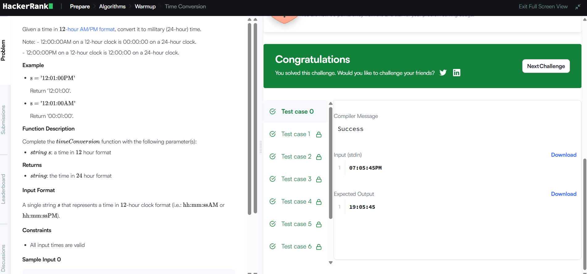
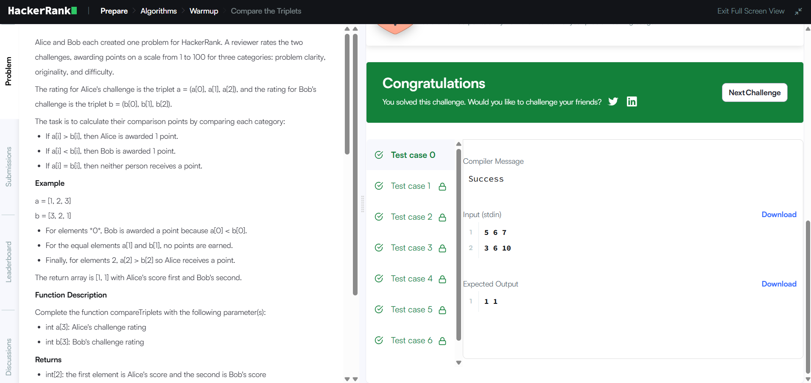
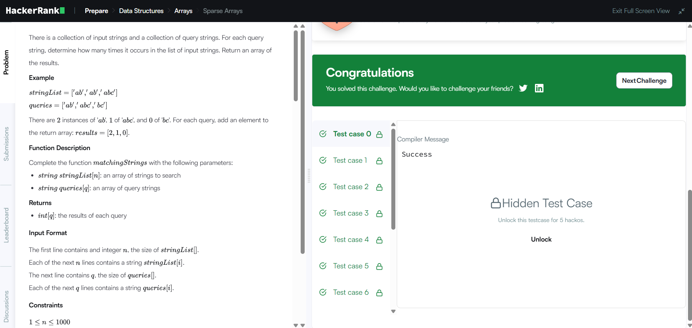

# HackerRank 3rd Semester Portfolio

## About

This repository contains my solutions for the HackerRank problems completed as part of Activity 8: HackerRank Algorithmic Problem-Solving & Portfolio Integration.

All solutions are implemented in Python 3.

## HackerRank Profile

[Visit my HackerRank Profile](https://www.hackerrank.com/profile/sinchananagaraj3)

## Problems Completed

| # | Problem | Topic | Time Complexity | Space Complexity |
|---|---|---|---|---|
| 1 | Diagonal Difference | 2D Arrays / Matrices | O(N) | O(1) |
| 2 | Dynamic Array | Data Structures / Arrays | O(N + Q) | O(N) |
| 3 | Time Conversion | Strings & Logic | O(1) | O(1) |
| 4 | Compare the Triplets | Basic Implementation | O(1) | O(1) |
| 5 | Sparse Arrays | Hash Maps / Strings | O(N + Q) | O(N) |

## HackerRank Submissions

### 1. Diagonal Difference

- HackerRank: Accepted
- Solution: [View Code](./Diagonal-Difference/solution.py)

### 2. Dynamic Array

- HackerRank: Accepted
- Solution: [View Code](./Dynamic-Array/solution.py)

### 3. Time Conversion

- HackerRank: Accepted
- Solution: [View Code](./Time-Conversion/solution.py)

### 4. Compare the Triplets

- HackerRank: Accepted
- Solution: [View Code](./Compare-Triplets/solution.py)

### 5. Sparse Arrays

- HackerRank: Accepted
- Solution: [View Code](./Sparse-Arrays/solution.py)

## HackerRank Badge

### Problem Solving / Python Badge

3-Star Badge: **To be updated after earning the required badge**

## Key Learning Outcomes

- Practiced array and matrix manipulation.
- Worked with dynamic arrays and nested sequences.
- Practiced string processing and time conversion.
- Implemented element-wise comparison and score tracking.
- Practiced frequency-based string matching.
- Improved understanding of time and space complexity.

## Technologies Used

- Python 3
- HackerRank
- GitHub# HackerRank 3rd Semester Portfolio

## About

This repository contains my solutions for the HackerRank problems completed as part of Activity 8: HackerRank Algorithmic Problem-Solving & Portfolio Integration.

All solutions are implemented in Python 3.

## HackerRank Profile

[Visit my HackerRank Profile](https://www.hackerrank.com/profile/sinchananagaraj3)

## Problems Completed

| # | Problem | Topic | Time Complexity | Space Complexity |
|---|---|---|---|---|
| 1 | Diagonal Difference | 2D Arrays / Matrices | O(N) | O(1) |
| 2 | Dynamic Array | Data Structures / Arrays | O(N + Q) | O(N) |
| 3 | Time Conversion | Strings & Logic | O(1) | O(1) |
| 4 | Compare the Triplets | Basic Implementation | O(1) | O(1) |
| 5 | Sparse Arrays | Hash Maps / Strings | O(N + Q) | O(N) |

## HackerRank Submissions

### 1. Diagonal Difference

- HackerRank: Accepted
- Solution: [View Code](./Diagonal-Difference/solution.py)

### 2. Dynamic Array

- HackerRank: Accepted
- Solution: [View Code](./Dynamic-Array/solution.py)

### 3. Time Conversion

- HackerRank: Accepted
- Solution: [View Code](./Time-Conversion/solution.py)

### 4. Compare the Triplets

- HackerRank: Accepted
- Solution: [View Code](./Compare-Triplets/solution.py)

### 5. Sparse Arrays

- HackerRank: Accepted
- Solution: [View Code](./Sparse-Arrays/solution.py)

## HackerRank Badge

### Problem Solving / Python Badge

3-Star Badge: **To be updated after earning the required badge**

## Key Learning Outcomes

- Practiced array and matrix manipulation.
- Worked with dynamic arrays and nested sequences.
- Practiced string processing and time conversion.
- Implemented element-wise comparison and score tracking.
- Practiced frequency-based string matching.
- Improved understanding of time and space complexity.

## Technologies Used

- Python 3
- HackerRank
- GitHub
